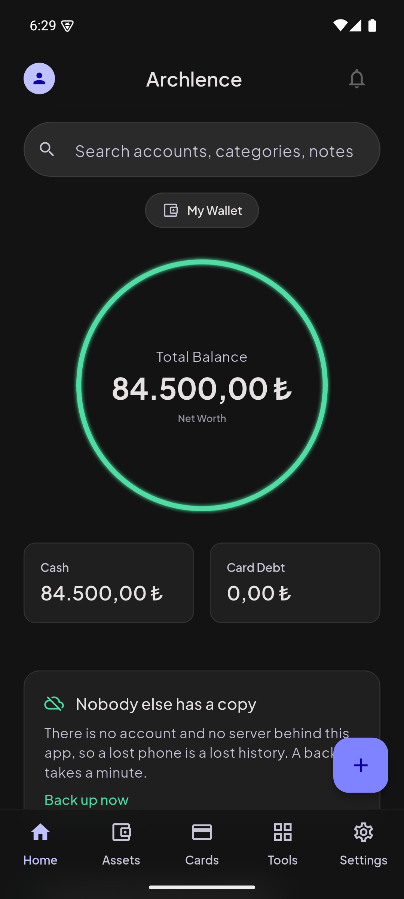
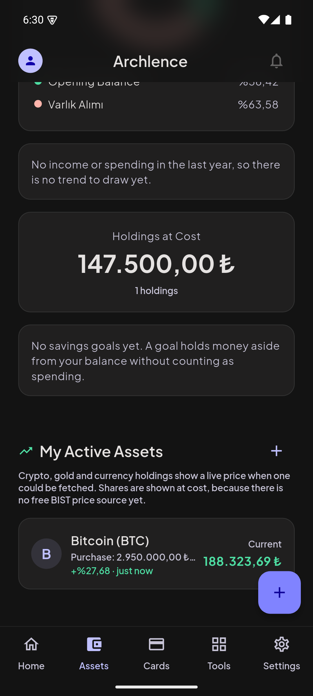
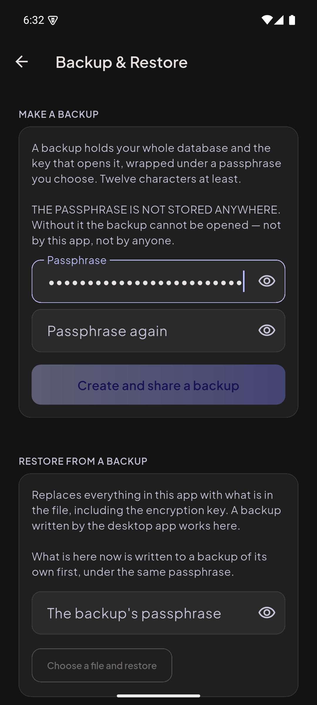
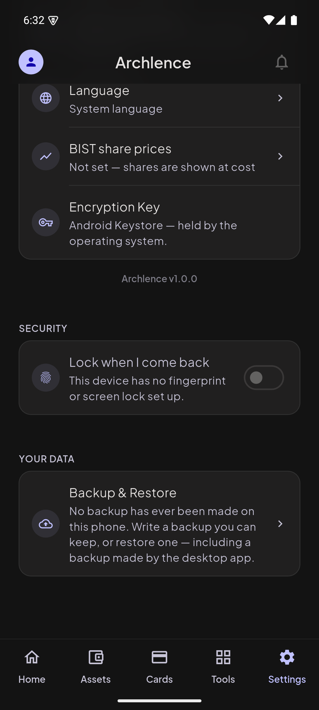

# Archlence Mobile

Personal finance for Android, built so that the data never leaves the phone.

Accounts, cards, transactions, holdings, a budget and savings goals — recorded
locally, encrypted with AES-256-GCM under a key held in the Android Keystore.
There is no account to create and no server to talk to. The Flutter client for
[Archlence](https://github.com/superuser-d0/archlence), whose desktop app is
Python/KivyMD and whose database file this one can read and write.

<p align="center">
  
  
  
  
</p>

## The claim, and how to check it

Every local-first app says the data stays on the device. This one is written so
you can verify it rather than believe it.

- **Nothing is uploaded, and there are three hosts in the whole app.** Every
  URL it can build is in one file,
  [`lib/services/price_providers.dart`](lib/services/price_providers.dart), and
  `grep -rn "Uri.https" lib/` finds all of them: `api.coingecko.com` and
  `api.frankfurter.dev` for prices, which take no credential and are called
  only with a list of symbols; and `www.nosyapi.com` for Turkish share prices,
  which is reached **only** if you have entered an API key of your own in
  Settings.

  What those requests carry is the list of symbols being priced, and — for the
  shares one — your own key, in a header rather than the query string. So a
  provider can see *which* assets you asked about, which is unavoidable when
  asking someone else for a price. What none of them carries is how much you
  hold, what anything is worth, any description, or any identifier for you.

  How thoroughly the app avoids the network is visible in the tests too:
  [`integration_test/live_price_device_test.dart`](integration_test/live_price_device_test.dart)
  is the only one in the whole suite that opens a socket.
- **The amounts and descriptions are encrypted at rest**, field by field, and
  the key lives in the platform key store rather than in the database beside
  them — [`lib/crypto/`](lib/crypto/).
- **A backup is yours to move.** Settings writes a verified package and hands
  it to the share sheet; the app cannot put it anywhere on its own.
- **The key can travel separately**, wrapped under a passphrase, for the case
  a whole backup does not cover: the data is still here and the key is gone.

The one thing it will not do is protect you from losing the phone. Nobody else
has a copy, which is the point and also the risk — so the app says how long
ago you last backed up, and asks again after a month.

## Status

**Shipping-ready but not shipped.** A fresh install walks through onboarding,
opens its first account, and from there records transactions, buys and sells
holdings, plans a budget, opens and funds savings goals, pays down a card and
manages subscriptions. No control in the app is inert.

The release build exists: `flutter build appbundle --release` produces a
signed App Bundle, which Play serves to a device as about 11MB. Nothing that
remains is a coding task: a developer account, a privacy policy at a public
URL, Play's Data Safety form, and an hour with a screen reader. The account
is the one that sets the date and the one to open first — a new personal
account can face a closed-testing period before it may publish to production,
which moves a launch by weeks rather than days. See
[docs/ROADMAP.md](docs/ROADMAP.md).

Building your own release needs your own signing keystore, which belongs to
whoever publishes; it is not in this repository and cannot be.

The privacy policy is written from what the code does rather than from a
template — it names the three hosts, what each request carries, and how to
check both yourself. It lives in one place,
[`lib/legal/privacy_policy.dart`](lib/legal/privacy_policy.dart): the app
renders it under Settings, [`docs/privacy.html`](docs/privacy.html) and
[`docs/gizlilik.html`](docs/gizlilik.html) are generated from it, and a test
fails if the published pages drift from the source or if the app ever gains a
fourth host the policy does not name.

| | |
| --- | --- |
| Unit tests | 1110 |
| Device tests | 14, on a real emulator or handset |
| `flutter analyze` | clean |
| Languages | Turkish and English, both complete |
| Minimum Android | as Flutter's current stable sets it |

**Holdings show a live price.** Crypto, gold and currency go through CoinGecko
and Frankfurter, called straight from the phone — no backend, no API key
shipped. Shares need a key of your own, entered in Settings: BIST data is
commercial, and a key shipped inside an app is a public key. Without one they
stay at cost, and each tile says which it got and how long ago.

**Backup and restore works in both directions**, including a package written by
the desktop app, replacing the database and the encryption key under a journal
that survives the process being killed. Both directions are proven against the
desktop's own `services/backup_service.py` rather than against a reading of the
format.

**An optional lock** re-asks for the phone's own fingerprint or PIN after a
minute away. It hides the screen, and says plainly that it adds no encryption.

## Running it

```bash
flutter pub get
flutter test
flutter run -d <device>
```

Both code generators' output is checked in, so a fresh clone builds without
running either:

```bash
dart run build_runner build          # drift codegen
flutter gen-l10n                     # labels, after editing lib/l10n/*.arb
```

Device tests need an emulator or handset. They exercise the real Android
Keystore, the real database file, the real screens and — in one file — the real
network:

```bash
flutter test integration_test/ -d <device>
```

A release build needs `android/key.properties` and the keystore it names.
Without them the build is refused rather than quietly signed with the SDK's
debug key; see [`android/key.properties.example`](android/key.properties.example).

Toolchain versions, SDK paths, the emulator AVD, which `flutter doctor`
complaints are safe to ignore, and what a device round leaves running
afterwards are all in the roadmap's Environment section.

## Layout

| Path | What lives there |
| --- | --- |
| `lib/money/` | Decimal amounts and the rounding rules, ported from the desktop |
| `lib/crypto/` | AES-256-GCM, field-level encryption, the key provider |
| `lib/data/` | Database connection and the desktop's schema, verbatim |
| `lib/backup/` | Backup packages: the bounded reader, the writer, the journalled restore |
| `lib/services/` | Accounts, the ledger, holdings, recurring, budget, savings, live pricing |
| `lib/screens/` | The five tabs, onboarding, and the forms behind them |
| `lib/widgets/` | Shared surfaces, the balance ring, the sheet frame |
| `lib/l10n/` | The Turkish and English label files, and the class generated from them |
| `lib/security/` | The resume lock |
| `lib/ui/` | Money formatting, error wording, the language choice, the loading/error/empty contract |
| `lib/theme/` | Obsidian Prime design tokens |
| `tool/` | Generators that produce the parity fixtures, run against the desktop |

## How this is tested, and why it is worth reading

**Anything claiming compatibility with the desktop app is tested against output
generated by the desktop's own modules** — 12 000 rounding vectors from its
`quantize_financial`, encryption envelopes from its `aead_crypto`, a schema
dump from its `initialize_database()`, a whole backup package written by its
`create_backup`. Testing a port against expectations written by hand tests the
derivation, not the port.

Which is why [`.gitattributes`](.gitattributes) pins this repository to LF
endings rather than the platform's. Those fixtures are compared against as
bytes, and a clone on Windows rewrites text files to CRLF by default —
silently, for most of them. One broke loudly enough to be caught; the rest
would have gone on being compared against something the desktop never wrote.

**The backup reader gets one thing more,** because it is the only parser here
fed input the app did not write: a corrupted package must fail as a backup
error and never as anything else. Not argued from one crafted file per
exception type — a valid package is mangled 400 different ways and every one
has to come back the same.

**Every rule is checked for teeth.** The code is deliberately broken and the
suite must fail. A test that cannot fail is decoration, and the habit keeps
catching tests that looked thorough and proved nothing: an assertion that
re-rounded a value before comparing it, a cross-check where two different ids
both happened to be `1`, a version check whose pattern could not match the
string it was written to catch.

**And running it finds what reading it cannot.** Every screen defect in
[docs/ROADMAP.md](docs/ROADMAP.md) was invisible in the source — a screen lock
that had never worked on any build ever made, a release manifest with no
internet permission, a heading that overflowed a small phone and was never laid
out where a test could see it.

**And a suite that only ever opens one screen is one screen's worth of proof.**
Nine hundred tests passed for months without a single one of them selecting a
tab other than the one the app starts on, so the other four had never been laid
out anywhere a guideline could look at them. Opening all five — at 1.5x and
2.0x font scale, on a 320dp phone, in Turkish — found six defects, one of them
overflowing at the *default* font size on an ordinary 360dp phone. The test
emulator is 411dp wide, which is why driving the app by hand had not caught
that one either.

The same question asked one level down — of the nine sheets, opened through
the functions that open them rather than by tapping a path to each — found
seven more, and all seven were one missing line: a `DropdownButtonFormField`
sizes its button to the selected item, so without `isExpanded` an account
label carrying a name *and* a balance overflows instead of ellipsizing. Two of
the app's nine dropdowns already had it. The worst of the seven was 152 pixels
over at the default font size, on a sheet with its own end-to-end test file —
which walks it on an 800dp surface, a width no phone has. A third sweep, of
the nine pushed routes, found nothing — and that is the comparison worth
keeping, because those are the screens that already had the guidelines applied
to them. All three sweeps are in the suite now, alongside rules that read the
source for the cases a sweep cannot lay out.

## Documentation

[docs/ROADMAP.md](docs/ROADMAP.md) is the long one, and it is the honest one: it
records what was done and how each claim was proven, which decisions are settled
so they are not reopened by accident, what is deliberately out of scope, and the
defects found along the way including the ones that were this project's own
fault. It opens with a "Pick up here" section.

## License

[Apache License 2.0](LICENSE). The same licence as the desktop app, which this
one is the client for and ports work from — the schema, the rounding rules,
the encryption envelope, the backup format.

Apache rather than MIT for two clauses that matter to an app people install:
§3 grants a patent licence explicitly, where MIT is silent, and §6 says plainly
that the licence does not hand over the name. Neither stops anyone forking
this — both licences allow that, deliberately.

Releases of the desktop app up to v1.0.1 were published under the MIT License
and remain available under those terms. See [NOTICE](NOTICE).

Third-party packages keep their own licences; the app lists them under
Settings.
